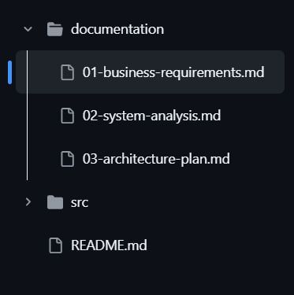

# Task 001
# Техническое задание: Telegram бот для парсинга IT статей

## Проект: IT News Parser Bot

### Цель проекта
Создать Telegram бота для парсинга IT статей с сайта [habr.com/ru/articles/](https://habr.com/ru/articles/) с возможностью просмотра карточек статей и их полного содержимого.

### Функциональные требования

#### Основные функции:
1. **Парсинг статей** с habr.com/ru/articles/
2. **Отображение карточек статей** с заголовком, картинкой и кратким содержанием
3. **Кнопка для раскрытия полного содержимого** статьи (кнопка с сообщением: "Скоро!")
4. **Поддержка markdown** для отображения фрагментов кода
5. **Инлайн и reply клавиатуры** для навигации по страницам сайта

### Структура проекта

``` bash
src/
├── bot/
│ ├── handlers/
│ │ ├── \_\_init\_\_.py
│ │ ├── user\_handlers.py # Обработчики пользовательских команд
│ │ └── callback\_handlers.py # Обработчики инлайн кнопок
│ ├── keyboards/
│ │ ├── \_\_init\_\_.py
│ │ ├── reply.py # Reply клавиатуры
│ │ └── inline.py # Инлайн клавиатуры
│ └── parser/
│ ├── \_\_init\_\_.py
│ └── itproger\_parser.py # Парсер статей
├── data/
│ ├── \_\_init\_\_.py
│ └── config.py # Конфигурация
├── app.py # Главный файл приложения
└── loader.py # Инициализация бота
```

(также добавить в корень проекта файлы: .gitignore, README.md, requirements.txt)


### Эталонная структура Вашего проекта:



#### Этап 1: Базовая настройка проекта

**Файлы для создания бота:**

**app.py**
```py
import handlers
from aiogram import executor
from loader import dp


if __name__ == "__main__":
    print("Bot running!")
    executor.start_polling(dp, skip_updates = True)     # все ранее отправленные сообщения боту, когда он был выключен, будут пропущены
```

**loader.py**
```py
from aiogram import Bot, Dispatcher
from data import config


bot = Bot(token=config.TOKEN, parse_mode = 'html')
dp = Dispatcher(bot)
```

**data/config.py**
```py
BOT_TOKEN = "YOUR_BOT_TOKEN_HERE"
ITPROGER_URL = "https://itproger.com/news"
```

#### Этап 2: Создание парсера

**bot/parser/itproger_parser.py**
```py
import requests
from bs4 import BeautifulSoup
from typing import List, Dict
import re


class ITProgerParser:
    def __init__(self):
        pass

    def get_news_list(self) -> List[Dict]:
        """Получить список последних новостей"""
        pass

    def get_article_content(self, article_url: str) -> Dict:
        """Получить полное содержимое статьи"""
        """ Оставить код пока пустым"""
        pass

    def _extract_code_blocks(self, text: str) -> str:
        """Извлечь и форматировать блоки кода для markdown"""
        pass
```
#### Этап 3: Создание клавиатур

**bot/keyboards/reply.py**

```PY
from aiogram.types import ReplyKeyboardMarkup, KeyboardButton

def defUpgrade():

    upgradeKB = ReplyKeyboardMarkup(resize_keyboard=True)
    buttonDataUpd = KeyboardButton(text="Обновить данные")

    upgradeKB.add(buttonDataUpd)

    return upgradeKB
```
**bot/keyboards/reply.py**
```py
from aiogram.types import InlineKeyboardMarkup, InlineKeyboardButton

def show_bot_user_menu():
    return InlineKeyboardMarkup(inline_keyboard=[
        [InlineKeyboardButton(text="➡️ Следующая статья", callback_data="next")]
    ])
```

#### Этап 4: Создание обработчиков
**bot/handlers/user_handlers.py**

```py
from aiogram import Dispatcher, types
from aiogram.dispatcher import FSMContext
from bot.parser.itproger_parser import ITProgerParser
from bot.keyboards.reply import main_keyboard
from bot.keyboards.inline import article_keyboard, pagination_keyboard


async def cmd_start(message: types.Message):
    """Обработчик команды /start"""
    pass


async def show_latest_news(message: types.Message):
    """Показать последние новости"""
    pass


async def search_articles(message: types.Message):
    """Поиск статей"""
    pass


def register_user_handlers(dp: Dispatcher):
    """Регистрация всех обработчиков пользователя"""
    pass
```

#### Этап 5: Реализовать документацию (в документе README.md) в виде .md файла

**Указать:**

## Что это?

(Ваше описание)

## Основные возможности

(Ваше описание)

## Как работает

(Ваше описание)

## (Указать гиперсылки на полную документацию (на три остальные файла: 01-business-requirements.md, 02-system-analysis.md, 03-architecture-plan.md))


## Установка и запуск

### Шаг 1: Клонирование проекта

```bash
git clone https:// -- ссылка на Ваш проект --
```

### Шаг 2: Установка зависимостей

Создайте виртуальное окружение и установите необходимые пакеты:

```bash
# Создание виртуального окружения
python -m venv venv

# Активация (Windows)
venv\Scripts\activate

# Активация (Linux/Mac)
source venv/bin/activate

# Установка зависимостей
pip install -r requirements.txt
```

### Шаг 3: Настройка конфигурации

(Ваше описание)

#### Шаг 4: Запуск бота

```bash
Ваша команда для запуска
```

Расписать первую документацию для бизнес требования и поместить в корень репозетория github в разделе /documentation с пометкой: Полная документация проекта доступна в папке docs/: в списке отметить имя первого файла "01-business-requirements.md" для создания первого документа использовать [шаблон:](https://github.com/k1rrrkvz/Practik_tasks_31is-23/blob/main/documentation/01-business-requirements.md) 

#### После проделанных всех этапов пригласите преподавателя в свой репозиторий для проверки работы

