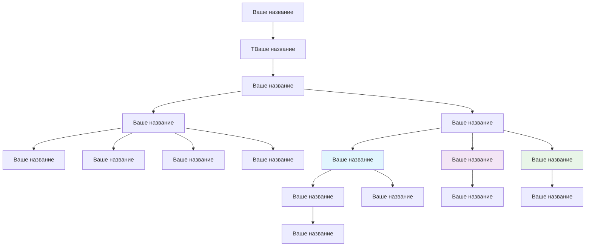

# План архитектуры

## 1. Общая архитектура системы

Ваше название

Пример графа (необходимо разработать свой с помощью ИИ)

## 2. Компоненты системы

Ваше описание

---

*Документация подготовлена: Имя Фамилия (@ник_github)*
